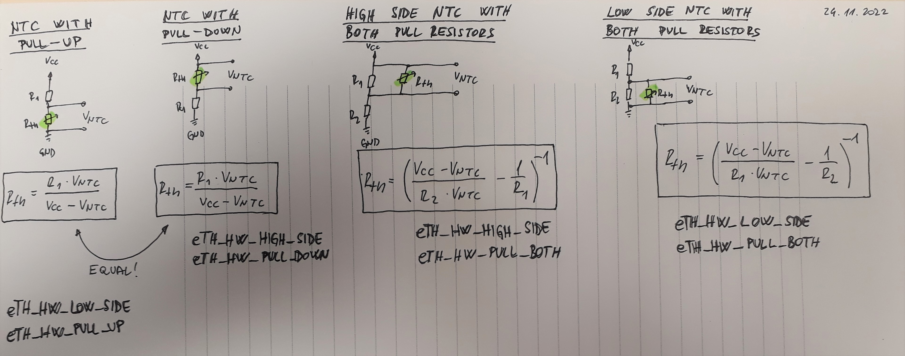
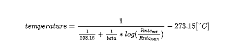

# **Thermistor**

Thermistor module converts temperature sensor measurement into real values in °C, °F or Kelvin units. Module is written in C programming lang with empasis to be highly portable and configurable to different HW layouts and temperature sensors. As name suggest module supports only pasive temperature measurement devices. For now NTC, PT100, PT500 and PT1000 sensor types are supported.

Supported thermistors HW topologies:
 - NTC with pull-down resistor
 - NTC with pull-up resistor
 - NTC both pull-down and pull-up resistor
 - PT100/500/1000 with pull-down resistor
 - PT100/500/1000 with pull-up resistor
 - PT100/500/1000 both pull-down and pull-up resistor

Picture bellow shows all supported NTC/PT1000 thermistor hardware connections:



## **Dependencies**

### **1. ADC Low Level driver**
It is mandatory to have following definition of low level driver API:
 - Function to retriev voltage on pin in volts. Prototype function: 
    ```C 
    float32_t adc_get_real (const adc_pins_t pin)
    ```
 - Function to retriev ADC reference voltage:
    ```C 
    float32_t adc_get_vref(void)
    ```

Additionally ADC low level driver must take following path:
```
"root/drivers/periphery/adc/adc.h"
```

### **2. Filter module**
If enabled filter *THERMISTOR_FILTER_EN = 1*, then [Filter](https://github.com/GeneralEmbeddedCLibraries/filter) must be part of project. Filter module must take following path:
```
"root/middleware/filter/src/filter.h"
```

## **General Embedded C Libraries Ecosystem**
In order to be part of *General Embedded C Libraries Ecosystem* this module must be placed in following path: 

```
root/drivers/devices/thermistor/"module_space"
```

## **NTC Temperature Calculation**

NTC thermistor based temperature measurement are calculated based on following formula:



And C implementation:
```C
////////////////////////////////////////////////////////////////////////////////
/*!
* @brief        Convert NTC resistance to degree C
*
* @param[in]    rth 			- Resistance of NTC thermistor
* @param[in]    beta 			- Beta factor of NTC
* @param[in]    rth_nom         - Nominal value of NTC @25 degC
* @return       temp 			- Calculated temperature
*/
////////////////////////////////////////////////////////////////////////////////
static float32_t th_calc_ntc_temperature(const float32_t rth, const float32_t beta, const float32_t rth_nom)
{
    float32_t temp = 0.0f;

    TH_ASSERT( rth_nom > 0.0f );

    // Calculate temperature
    temp = (float32_t) (( 1.0f / ( TH_NTC_25DEG_FACTOR + (( 1.0f / beta ) * log( rth / rth_nom )))) - 273.15f );

    return temp;
}
```

## **PT100/500/1000 Temperature Calculation**

PT100, PT500 and PT1000 thermistor based temperature measurement are calculated based on [PT Calculation Tabel](doc/pt1000_pt100_pt500_tables.xlsx). Picture below shows temperature characteristics of all three PT types with an 2nd order polynomial approximation curve:


C implementation for PT100:
```C

```

C implementation for PT500:
```C

```

C implementation for PT1000:
```C


```

## **API**
| API Functions | Description | Prototype |
| --- | ----------- | ----- |
| **th_init** | Initialization of thermistor module | th_status_t th_init(void) |


## **Usage**

**GENERAL NOTICE: Put all user code between sections: USER CODE BEGIN & USER CODE END!**


1. Copy template files to root directory of module.
2. Configure CLI module for application needs. Configuration options are following:

| Configuration | Description |
| --- | --- |
| **TH_HNDL_PERIOD_S** 			| Period of main thermistor handler in seconds. |


3. List all used thermistors inside *thermistor_cfg.h*:
```C
/**
*  Thermistor count
*/
typedef enum
{
    // USER CODE BEGIN...
    
    eTH_NTC_INT = 0,
    eTH_NTC_COMP,
    eTH_PTC_AUX,

    // USER CODE END...

    eTH_NUM_OF
} th_opt_t;
```

4. Setup thermistor configurations inside *thermistor_cfg.c*:


For hardware related configuration (*hw_conn* and *hw_pull*) help with picture above.

5. Initialize thermistor module:
```C
// Init thermistor
if ( eTH_OK != th_init())
{
    // Initialization error...
    // Furhter actions here...
}
```

6. Make sure to call *th_hndl()* at fixed period of *TH_HNDL_PERIOD_S* configurations:
```C
@at TH_HNDL_PERIOD_S period
{
    // Handle thermistor sensors
    th_hndl();
}
```


