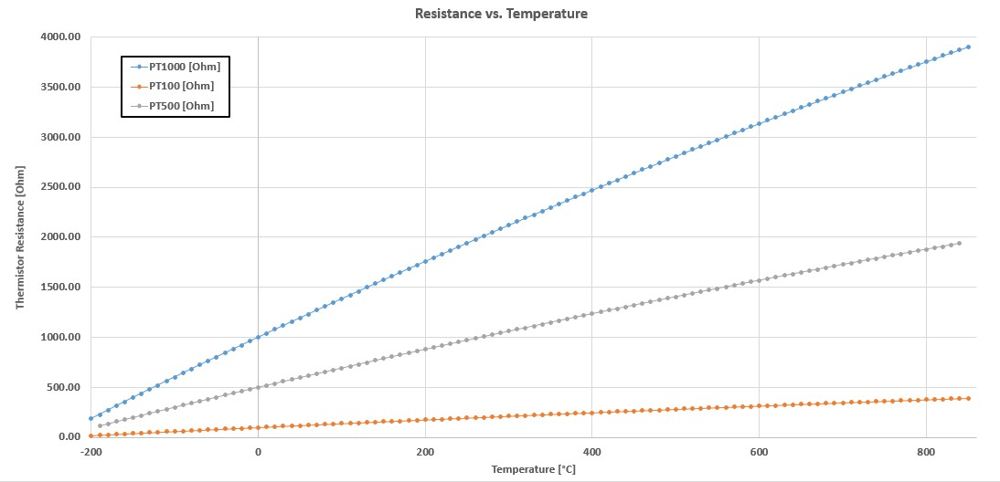
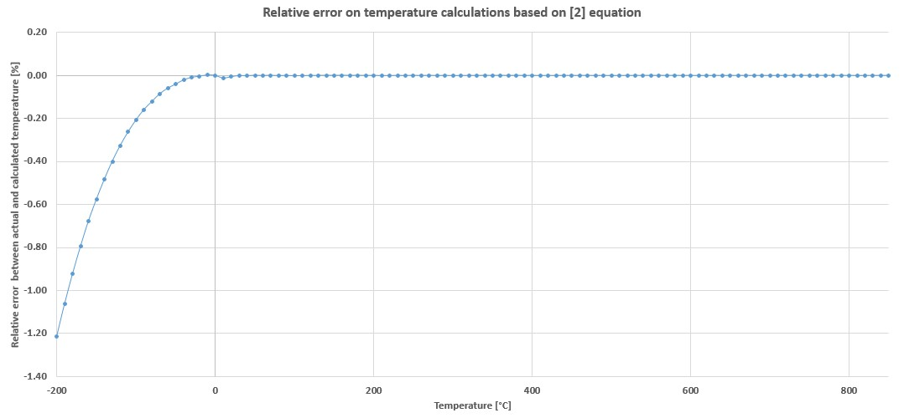

# **Thermistor**

Thermistor module converts temperature sensor measurement into real values in °C, °F or Kelvin units. Module is written in C programming lang with empasis to be highly portable and configurable to different HW layouts and temperature sensors. As name suggest module supports only pasive temperature measurement devices. For now NTC, PT100, PT500 and PT1000 sensor types are supported.

Supported thermistors HW topologies:
 - NTC with pull-down resistor
 - NTC with pull-up resistor
 - NTC both pull-down and pull-up resistor
 - PT100/500/1000 with pull-down resistor
 - PT100/500/1000 with pull-up resistor
 - PT100/500/1000 both pull-down and pull-up resistor

Picture bellow shows all supported NTC/PT1000 thermistor hardware connections:


## **Dependencies**

### **1. ADC Low Level driver**
It is mandatory to have following definition of low level driver API:
 - Function to retriev voltage on pin in volts. Prototype function: 
    ```C 
    float32_t adc_get_real (const adc_pins_t pin)
    ```

Additionally ADC low level driver must take following path:
```
"root/drivers/periphery/adc/adc.h"
```

### **2. Filter module**
If enabled filter *THERMISTOR_FILTER_EN = 1*, then [Filter](https://github.com/GeneralEmbeddedCLibraries/filter) must be part of project. Filter module must take following path:
```
"root/middleware/filter/src/filter.h"
```

## **General Embedded C Libraries Ecosystem**
In order to be part of *General Embedded C Libraries Ecosystem* this module must be placed in following path: 

```
root/drivers/devices/thermistor/"module_space"
```

## **NTC Temperature Calculation**

NTC thermistor based temperature measurement are calculated based on following formula:


C implementation for NTC calculation:
```C
////////////////////////////////////////////////////////////////////////////////
/*!
* @brief        Convert NTC resistance to degree C
*
* @param[in]    rth 			- Resistance of NTC thermistor
* @param[in]    beta 			- Beta factor of NTC
* @param[in]    rth_nom         - Nominal value of NTC @25 degC
* @return       temp 			- Calculated temperature
*/
////////////////////////////////////////////////////////////////////////////////
static float32_t th_calc_ntc_temperature(const float32_t rth, const float32_t beta, const float32_t rth_nom)
{
    float32_t temp = 0.0f;

    TH_ASSERT( rth_nom > 0.0f );

    // Calculate temperature
    temp = (float32_t) (( 1.0f / ( TH_NTC_25DEG_FACTOR + (( 1.0f / beta ) * log( rth / rth_nom )))) - 273.15f );

    return temp;
}
```

And *TH_NTC_25DEG_FACTOR* factor:
```C
/**
 *  Factor for NTC calculation when given nominal NTC value at 25 degC
 */
#define TH_NTC_25DEG_FACTOR             ((float32_t) ( 1.0 / 298.15 ))      // Leave double
```

## **PT100/500/1000 Temperature Calculation according to DIN EN 60751**

PT100, PT500 and PT1000 thermistor calculations are based on DIN EN 60751 standard with limitation to use only 2nd order polynomial approximation curve. All informations about calculations can be found in [PT Calculation Tabel](doc/pt1000_pt100_pt500_tables.xlsx).

Picture below shows temperature characteristics of PT100, PT500 and PT1000. 


This library is not fully complient with mentioned standard as calculations are being a bit modified. Therefore for negative temperature ranges some error is produces, but no larger than 2%. 


Software for PT100/500/1000 calculations were tested using [SICA Simulator UC RTD Calibrator for RTD](https://www.sika.net/en/series/mono-functions-process-calibrators-for-resistance-thermometers-uc-rtd2/). 


C implementation for PT100 calculation:
```C
////////////////////////////////////////////////////////////////////////////////
/*!
* @brief        Convert PT100 resistance to degree C
*
* @note     Calculation of PT500 according to DIN EN60751 standard.
*           For futher details look at table: doc/pt1000_pt100_pt500_tables.xlsx 
*
* @param[in]    rth 			- Resistance of PT100 thermistor
* @return       temp 			- Calculated temperature
*/
////////////////////////////////////////////////////////////////////////////////
static float32_t th_calc_pt100_temperature(const float32_t rth)
{
	float32_t temp  = 0.0f;

	// Limit termistor resistance
	const float32_t rth_lim = th_limit_f32( rth, TH_PT100_MIN_OHM, TH_PT100_MAX_OHM );

	// Calculate temperature
	temp = (float32_t) (( -TH_PT_DIN_EN60751_A + sqrtf( TH_PT_DIN_EN60751_AA - TH_PT_DIN_EN60751_4B * ( 1 - rth_lim / 100.0f ))) / TH_PT_DIN_EN60751_2B );
    
    return temp;
}
```

C implementation for PT500 calculation:
```C
////////////////////////////////////////////////////////////////////////////////
/*!
* @brief        Convert PT500 resistance to degree C
*
* @note     Calculation of PT500 according to DIN EN60751 standard.
*           For futher details look at table: doc/pt1000_pt100_pt500_tables.xlsx 
*
* @param[in]    rth 			- Resistance of PT500 thermistor
* @return       temp 			- Calculated temperature
*/
////////////////////////////////////////////////////////////////////////////////
static float32_t th_calc_pt500_temperature(const float32_t rth)
{
	float32_t temp  = 0.0f;

	// Limit termistor resistance
	const float32_t rth_lim = th_limit_f32( rth, TH_PT500_MIN_OHM, TH_PT500_MAX_OHM );

	// Calculate temperature
	temp = (float32_t) (( -TH_PT_DIN_EN60751_A + sqrtf( TH_PT_DIN_EN60751_AA - TH_PT_DIN_EN60751_4B * ( 1 - rth_lim / 500.0f ))) / TH_PT_DIN_EN60751_2B );
    
    return temp;
}
```

C implementation for PT1000 calculation:
```C
////////////////////////////////////////////////////////////////////////////////
/*!
* @brief        Convert PT1000 resistance to degree C
*
* @note     Calculation of PT1000 according to DIN EN60751 standard.
*           For futher details look at table: doc/pt1000_pt100_pt500_tables.xlsx 
*
* @param[in]    rth 			- Resistance of PT1000 thermistor
* @return       temp 			- Calculated temperature
*/
////////////////////////////////////////////////////////////////////////////////
static float32_t th_calc_pt1000_temperature(const float32_t rth)
{
	float32_t temp  = 0.0f;

	// Limit termistor resistance
	const float32_t rth_lim = th_limit_f32( rth, TH_PT1000_MIN_OHM, TH_PT1000_MAX_OHM );

	// Calculate temperature
	temp = (float32_t) (( -TH_PT_DIN_EN60751_A + sqrtf( TH_PT_DIN_EN60751_AA - TH_PT_DIN_EN60751_4B * ( 1 - rth_lim / 1000.0f ))) / TH_PT_DIN_EN60751_2B );
    
    return temp;
}
```

Calculation factors/limits are according to DIN EN60751 standard:
```C
/**
 *	PT100/500/1000 temperature calculation factors according
 *	to DIN EN60751 standard
 */
#define TH_PT_DIN_EN60751_A		( 3.9083e-3 )	// degC^-1
#define TH_PT_DIN_EN60751_B		( -5.775e-7 )	// degC^-2

/**
 *		Precalculated factors for PT100/500/1000 calculations
 */
#define TH_PT_DIN_EN60751_AA	(( float32_t )( TH_PT_DIN_EN60751_A * TH_PT_DIN_EN60751_A ))
#define TH_PT_DIN_EN60751_2B	(( float32_t )( 2.0 * TH_PT_DIN_EN60751_B ))
#define TH_PT_DIN_EN60751_4B	(( float32_t )( 4.0 * TH_PT_DIN_EN60751_B ))

/**
 *		PT100/500/1000 Resistance Limits
 *
 * @note Taken from "doc/pt1000_pt100_pt500_tables.xlsx" table!
 *
 *	Unit: Ohm
 */
#define TH_PT1000_MAX_OHM		( 3904.81f )
#define TH_PT1000_MIN_OHM		( 185.20f )
#define TH_PT100_MAX_OHM		( 390.48f )
#define TH_PT100_MIN_OHM		( 18.52f )
#define TH_PT500_MAX_OHM		( 1937.74f )
#define TH_PT500_MIN_OHM		( 114.13f )
```

## **API**
| API Functions | Description | Prototype |
| --- | ----------- | ----- |
| **th_init** | Initialization of thermistor module | th_status_t th_init(void) |
| **th_is_init** | Get initialization flag | th_status_t th_is_init(bool * const p_is_init) |
| **th_hndl** | Thermistor handler | th_status_t th_hndl(void) |
| **th_get_degC** | Get un-filtered temperature in degrees C | th_status_t th_get_degC(const th_opt_t th, float32_t * const p_temp) |
| **th_get_degF** | Get un-filtered temperature in degrees F | th_status_t th_get_degF(const th_opt_t th, float32_t * const p_temp) |
| **th_get_kelvin** | Get un-filtered temperature in kelvin | th_status_t th_get_kelvin(const th_opt_t th, float32_t * const p_temp) |
| **th_get_resistance** | Get thermistor resistance | th_status_t th_get_resistance(const th_opt_t th, float32_t * const p_res) |
| **th_get_status** | Get thermistor status | th_status_t th_get_status(const th_opt_t th) |

If filter is enabled (*TH_FILTER_EN* = 1) then following API is also available:
| API Functions | Description | Prototype |
| --- | ----------- | ----- |
| **th_get_degC_filt** | Get LPF filtered temperature in degrees C | th_status_t th_get_degC_filt(const th_opt_t th, float32_t * const p_temp) | 
| **th_get_degF_filt** | Get LPF filtered temperature in degrees F | th_status_t th_get_degF_filt(const th_opt_t th, float32_t * const p_temp) | 
| **th_get_kelvin_filt** | Get LPF filtered temperature in kelvin | th_status_t th_get_kelvin_filt(const th_opt_t th, float32_t * const p_temp) | 
| **th_set_lpf_fc** | Change LPF cutoff frequency | th_status_t th_set_lpf_fc(const th_opt_t th, const float32_t fc) | 
| **th_get_lpf_fc** | Get LPF cutoff frequency | th_status_t th_get_lpf_fc(const th_opt_t th, float32_t * const p_fc) | 


## **Usage**

**GENERAL NOTICE: Put all user code between sections: USER CODE BEGIN & USER CODE END!**


1. Copy template files to root directory of module.
2. Configure CLI module for application needs. Configuration options are following:

| Configuration | Description |
| --- | --- |
| **TH_HNDL_PERIOD_S** | Period of main thermistor handler in seconds. |
| **TH_FILTER_EN** | Enable/Disable usage of filter module. |
| **TH_SUPPLY_RIPPLE_COMP_EN** | Enable/Disable power supply ripple. |
| **TH_SUPPLY_ADC_CH** | Power supply measurement ADC channel. |
| **TH_SUPPLY_V** | Power supply voltage of thermistor sensing circuit. |
| **TH_DEBUG_EN** | Enable/Disable debugging mode. |
| **TH_ASSERT_EN** | Enable/Disable asserts. Shall be disabled in release build! |
| **TH_DBG_PRINT** | Definition of debug print. |
| **TH_ASSERT** | Definition of assert. |

3. List all used thermistors inside *thermistor_cfg.h*:
```C
/**
*  Thermistor count
*/
typedef enum
{
    // USER CODE BEGIN...
    
    eTH_NTC_INT = 0,
    eTH_NTC_COMP,
    eTH_PTC_AUX,

    // USER CODE END...

    eTH_NUM_OF
} th_opt_t;
```

4. Setup thermistor configurations inside *thermistor_cfg.c*:

```C
/**
 *      Thermistor configuration table
 *  
 *  @note   Following condition must be taken into account:
 *              
 *              1. lpf_fc > 0
 *              2. Valid HW configuration are: 
 *                  - eTH_HW_LOW_SIDE  with eTH_HW_PULL_UP
 *                  - eTH_HW_HIGH_SIDE with eTH_HW_PULL_DOWN
 *                  - eTH_HW_LOW_SIDE  with eTH_HW_PULL_BOTH
 *                  - eTH_HW_HIGH_SIDE with eTH_HW_PULL_BOTH
 *              3. Range: Max is larger that min value
 */
static const th_cfg_t g_th_cfg[eTH_NUM_OF] = 
{
    // USER CODE BEGIN...

	// NTC Configurations
	// ----------------------------------------------------------------------------------------------

    [eTH_NTC_INT]	= 
    {   
        .adc_ch             = eADC_TEMP_INT,    
        .hw_conn            = eTH_HW_LOW_SIDE, 
        .hw_pull            = eTH_HW_PULL_UP, 
        .pull_up            = 11e3f, 
        .pull_down          = 0, 
        .lpf_fc             = 1.0f,    
        .type               = eTH_TYPE_NTC, 
        .sensor.ntc.beta    = 3380.0f,
        .sensor.ntc.nom_val = 10e3f,
        .range.min          = -25.0f,
        .range.max          = 150.0f,
        .err_type           = eTH_ERR_FLOATING,
    },

    [eTH_NTC_COMP]	= 
    {   
        .adc_ch             = eADC_TEMP_COMP,    
        .hw_conn            = eTH_HW_LOW_SIDE, 
        .hw_pull            = eTH_HW_PULL_UP, 
        .pull_up            = 11e3f, 
        .pull_down          = 0, 
        .lpf_fc             = 1.0f,    
        .type               = eTH_TYPE_NTC, 
        .sensor.ntc.beta    = 3380.0f,
        .sensor.ntc.nom_val = 10e3f,
        .range.min          = -25.0f,
        .range.max          = 150.0f,
        .err_type           = eTH_ERR_FLOATING,
    },

    // ----------------------------------------------------------------------------------------------


	// PT1000 Configurations
	// ----------------------------------------------------------------------------------------------

    [eTH_PTC_AUX]	= 
    {   
        .adc_ch             = eADC_TEMP_AUX,    
        .hw_conn            = eTH_HW_LOW_SIDE, 
        .hw_pull            = eTH_HW_PULL_UP, 
        .pull_up            = 11e3f, 
        .pull_down          = 0, 
        .lpf_fc             = 1.0f,    
        .type               = eTH_TYPE_PT1000, 
        .range.min          = -25.0f,
        .range.max          = 150.0f,
        .err_type           = eTH_ERR_FLOATING,
    },

    // ----------------------------------------------------------------------------------------------

    // USER CODE END...
};
```

For hardware related configuration (*hw_conn* and *hw_pull*) help with picture above.

5. Initialize thermistor module:
```C
// Init thermistor
if ( eTH_OK != th_init())
{
    // Initialization error...
    // Furhter actions here...
}
```

6. Make sure to call *th_hndl()* at fixed period of *TH_HNDL_PERIOD_S* configurations:
```C
@at TH_HNDL_PERIOD_S period
{
    // Handle thermistor sensors
    th_hndl();
}
```


